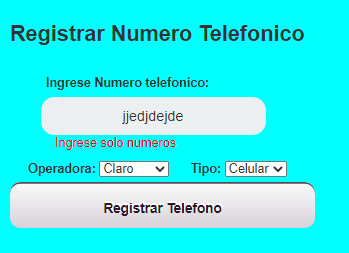
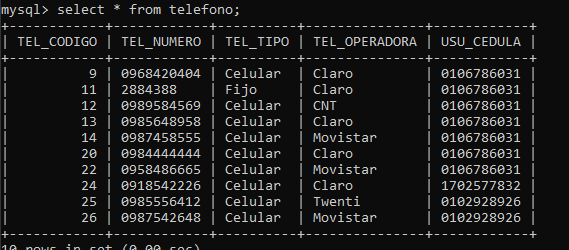
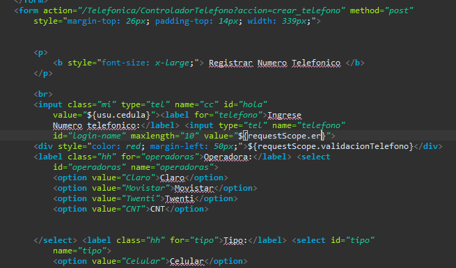
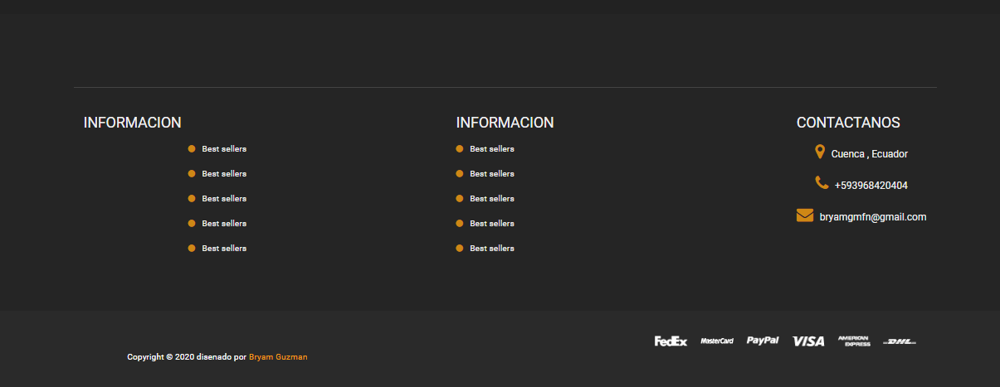

| [./media/image1.png](./media/image1.png)                                                                                                                                                                                                                                                                                                                                                                                                                                                                                | **FORMATO DE INFORME DE PRÁCTICA DE LABORATORIO / TALLERES / CENTROS DE SIMULACIÓN – PARA ESTUDIANTES** |                                                                                                                                                                                                  |
|-------------------------------------------------------------------------------------------------------------------------------------------------------------------------------------------------------------------------------------------------------------------------------------------------------------------------------------------------------------------------------------------------------------------------------------------------------------------------------------------------------------------------|---------------------------------------------------------------------------------------------------------|--------------------------------------------------------------------------------------------------------------------------------------------------------------------------------------------------|
|                                                                                                                                                                                                                                                                                                                                                                                                                                                                                                                         |                                                                                                         |                                                                                                                                                                                                  |
| **CARRERA**: Computación                                                                                                                                                                                                                                                                                                                                                                                                                                                                                                | **ASIGNATURA**: Plataformas Web                                                                         |                                                                                                                                                                                                  |
| **NRO. PRÁCTICA**:                                                                                                                                                                                                                                                                                                                                                                                                                                                                                                      | 2                                                                                                       | **TÍTULO PRÁCTICA**: Desarrollo de una aplicación JEE basado en Servlets, JSP y JDBC para el intercambio de datos en un modelo de tres capas aplicando los patrones diseño de software MVC y DAO |
| **OBJETIVO ALCANZADO:**  Diseñar y desarrollar modelos de software en diferentes niveles de abstracción y modelos de datos a nivel transaccional y analítico con entornos de desarrollo actuales. Persistencia de datos mediante DAOJdbc y manipulación de estos, ya sea buscando por medio de código o enlistándolos en una tabla                                                                                                                                                                                      |                                                                                                         |                                                                                                                                                                                                  |
| **ACTIVIDADES DESARROLLADAS**                                                                                                                                                                                                                                                                                                                                                                                                                                                                                           |                                                                                                         |                                                                                                                                                                                                  |
| **Creación del repositorio en GitHub**                                                                                                                                                                                                                                                                                                                                                                                                                                                                                  |                                                                                                         |                                                                                                                                                                                                  |
| **RESULTADO(S) OBTENIDO(S)**: Se ha desarrollado una aplicación con tecnología JEE para gestionar una agenda telefónica en la web,se ha aplicado patrones de diseño de software MVC y DAO, en donde, los modelos fueron clases POJOs de Java, la vista fue JSP + JSTL y los controladores a través de DAOs y Servlets.                                                                                                                                                                                                  |                                                                                                         |                                                                                                                                                                                                  |
| **CONCLUSIONES**: La implementación de tecnologías actuales en el desarrollo web es muy importante, porque la tecnología avanza muy rápido y no nos podemos quedar atrás, una de estas tecnologías es JEE, que toma mas tiempo que otras herramientas, pero se puede decir que ofrece mayor seguridad con filtros y sesiones, así también mediante el uso de patrón de diseño se puede conseguir una mejor organización a nuestra aplicación, sabiendo que tener buenas practicas es importante al momento de programar |                                                                                                         |                                                                                                                                                                                                  |
| **RECOMENDACIONES**: Aplicar conceptos de interacción humano máquina para el desarrollo de la GUI.                                                                                                                                                                                                                                                                                                                                                                                                                      |                                                                                                         |                                                                                                                                                                                                  |

**Arquitectura del Modelo**

**Requisitos aplicación Web**

**Los usuarios pueden registrarse en la aplicación a través de un formulario de
creación de cuentas**

**Método Persistencia**

**Servlet**

Después de una larga validación de datos, se puede crear un nuevo usuario, con
la información que fue obtenida en el JSP, se inicia sesión con el usuario y
creado y se le envía a la pagina principal privada que pertenece a cada usuario

Después de un largo proceso de validación, finalmente se ha creado el usuario
con éxito y redirige hacia la página principal privada del usuario

Se puede observar que se ha insertado un nuevo usuario en la base de datos

**JSP**

**Un usuario puede iniciar sesión usando su correo y contraseña**

**Servlet**

Se ha trabajado con sesiones para aumentar la seguridad del sistema y se le ha
enviado un objeto de tipo **Usuario,** el cual nos va a permitir personalizar la
parte privada para cada cliente y así mismo mediante filtros asegurar que no sea
posible infiltrarse una vez se ha cerrado sesión

**JSP**

En esta parte se llama al Servlet Controlador y se le envía los parámetros
necesarios para inicio de sesión, así mismo si los datos son incorrectos, el
servlet devolverá algunos mensajes de validación, de no ser así, redirige hacia
la página principal del usuario en la parte privada.

Como se ha trabajado con formularios, ha sido necesario validar los datos de
entrada para un correcto funcionamiento

**Formulario de log in**

**Validación formularios**

Luego de un inicio correcto de sesión redirige hacia la página principal del
usuario

**Una vez iniciado sesión el usuario podrá:**

-   **Registrar, modificar, eliminar, buscar y listar sus teléfonos**

>   **Método de Persistencia(Registrar):**

>   **Servlet:**

>   Despues de validar correctamente los parámetros, se procede a crear el
>   teléfono, se agregar al usuario el teléfono creado, y posteriormente se en
>   via el objeto Usuario a la sesion para refrescar la tabla

>   Registrado correctamente y de forma automática se refresca la tabla

>   **JSP**

>   Envia de parámetro **acción=crear_telefono,** puesto que todas las acciones
>   se encuentran en el mismo controlado y es necesario identificarlas

>   **Actualizar y Eliminar**

>   El usuario tiene una lista de números que pueden ser eliminados o
>   actualizados, ingresa el numero en la caja de texto indicada y puede
>   realizar cualquiera de las dos acciones

>   **Listar los números de teléfono de un usuario usando su número de cédula o
>   correo electrónico**

>   Para esto se ha creado dos métodos en la persistencia

>   **Buscar por cedula**

>   **Buscar por correo**

>   **Servlet(Controlador)**

>   Realiza la respectiva validación y luego busca con los métodos antes
>   expuestos.

>   Es un correo valido por lo tanto devuelve la siguiente tabla, ocurre lo
>   mismo con la cedula

>   Al dar click en el enlace de correo, automáticamente se abre la aplicación
>   predeterminado para correo

>   Así mismo ocurre cuando se da click a uno de los teléfonos de la lista, se
>   abre la aplicación predeterminada para hacer llamadas

>   **Filtros**

>   Se ha creado dos filtros, uno para redireccion de JSPs y otro para la
>   redireccion de los Servlets, los dos dirigen hacia la ventana llamada
>   **IniciarSesion.jsp**

>   **FiltroServlet**

>   **Filtro JSPs**

>   **Funcionamiento Filtro**

>   Estoy en mi cuenta

>   Al momento de aplastar en el icono de teléfono, me dirigió hacia la parte
>   publica de la pagina web

>   Ahora quiero volver a mi cuenta personal, entonces como la sesión sigue
>   iniciada, me va a permitir regresar.

>   Ahora voy a cerrar sesion en mi cuenta

>   Y me encuentro nuevamente en la parte del inicio

>   Al momento de hacer click en **Mi cuenta**, el filtro va a activarse, pues
>   no encuentra ninguna sesión activa, me redirige hacia la página de login.

>   **Parte publica**

>   Pagina propuesta por el docente:

>   Se ha diseñado una pagina muy similar a la propuesta por el docente:

**Nombre de estudiante: \_____________________Bryam Guzman_______\_**

**Firma de estudiante: \___________\_**

**\__________________\_**
